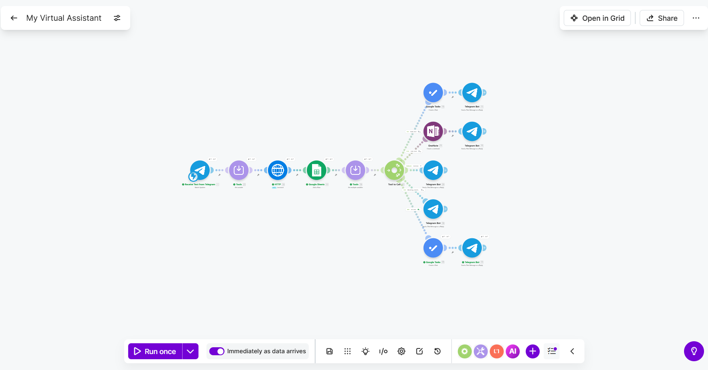
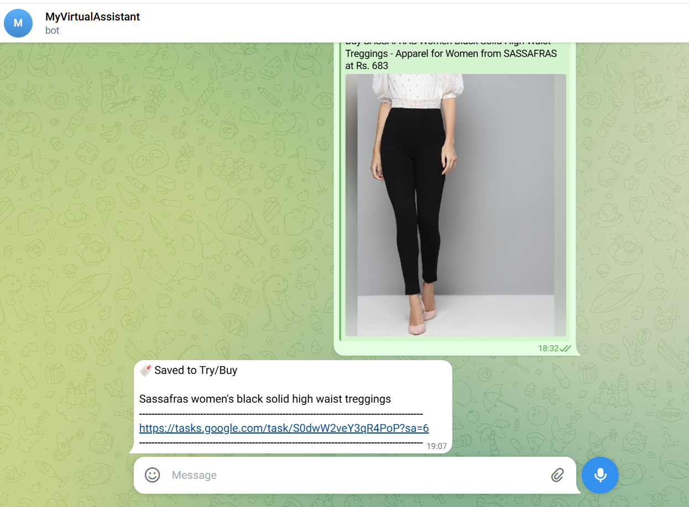
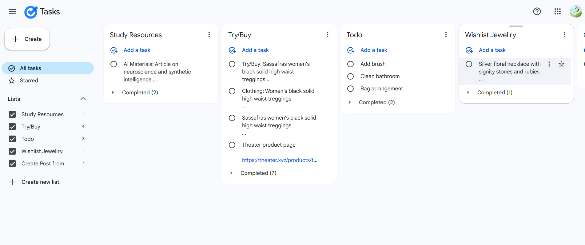

# 🤖 MyVirtualAssistant

> 🚀 AI Automation System using **Make.com + Groq AI + MCP Architecture**

---

## 🧠 Problem Statement

Managing tasks, bookmarks, notes, and ideas across apps is fragmented and inefficient.

Users need:
- One interface
- Smart categorization
- Automated actions
- AI-assisted workflows

---

## 💡 Solution

A Telegram-based AI assistant that:
- Understands natural language
- Converts it into structured JSON
- Executes actions via Make.com
- Stores data centrally
- Automates task workflows

---

## 🧠 Key Highlights

- MCP Architecture (AI decision layer)
- Make.com Execution Layer
- Structured JSON-driven automation
- Category-based workflow routing
- Real-time Telegram interaction

---

## 🌟 Why This Project Stands Out

It demonstrates:
- 🧠 AI-driven decision systems (MCP pattern)
- ⚙️ Deterministic execution pipelines
- 🏗️ Scalable system architecture
- 📦 Real-world business use cases
- 🔄 End-to-end automation lifecycle

---

## 🏗️ System Architecture

```
User (Telegram)
     ↓
Make.com Trigger
     ↓
HTTP → MCP Backend (FastAPI)
     ↓
Groq AI (Intent + Tool Selection)
     ↓
Structured JSON Output
     ↓
Make Router (tool_to_call)
     ↓
Execution Layer:
   - Google Sheets (Storage)
   - Google Tasks (Actions)
     ↓
Telegram Response
```




---

## 🧠 Architecture Principle

> AI decides. Automation executes.

| Layer | Role |
|------|------|
| AI (MCP) | Decision engine |
| Make | Execution engine |
| Sheets | Data layer |
| Tasks | Action layer |

---

## ⚙️ Tech Stack

- Telegram Bot API
- Make.com
- Groq AI (LLaMA3)
- FastAPI (Python Backend)
- Google Sheets API
- Google Tasks API

---

## 🔄 Workflow Deep Dive

### Step 1: User Input

User sends:
```
task Clean bedroom
```

---

### Step 2: MCP Processing

AI returns:

```json
{
 "request_type": "Task",
 "tool_to_call": "task_tool",
 "result": "Clean bedroom"
}
```

---

### Step 3: Make Execution

- Router reads `tool_to_call`
- Executes corresponding module
- Saves data / creates task
- Sends Telegram response

---

## 🔗 Smart URL Intelligence

System automatically:
- Detects content type
- Categorizes intelligently
- Generates summaries
- Triggers contextual tasks

### Categories

- Jewellery 💍
- Clothing 👗
- Accessories 🧢
- Home Decor 🏠
- AI Materials 🤖
- Instagram 📱
- General 📦

---

## 📊 Data Model

### Bookmarks

| Field | Description |
|------|------------|
| URL | Link |
| Category | AI classified |
| Summary | Generated |
| Date | Timestamp |

---

### Tasks

| Field | Description |
|------|------------|
| Task | Title |
| Category | Source |
| Status | Pending |
| Date | Created |

---

## 🔗 Features

- Task creation
- URL categorization
- Smart summaries
- Rewrite text
- Idea generation
- Notes management

---

## 🎬 Demo Script (Record This)

1. Send: `task Buy milk`
2. Send: `rewrite make this polite`
3. Send: URL
4. Send: `idea AI HR bot`

Show:
- Task creation
- URL categorization
- AI response
- Telegram output

---

## 🚀 This project can be extened further to implement 

- Context Memory Layer
- Smart Task Search
- Priority Detection
- Dashboard UI

---

## 🧠 Key Learnings

- AI should decide, not execute
- Clean architecture beats complexity
- Separation of concerns is critical
- MCP enables scalable AI systems

---

## 📈 Business Value

- Saves time
- Centralizes productivity
- Enables automation at scale
- Improves decision making
- Acts as Virutal Recorder Assistant  

---

## 🏁 Conclusion

This is a production-ready AI assistant system combining:
- Intelligence
- Automation
- Scalability
- Real-world usability

---

⭐ Built to demonstrate top-tier AI + Automation skills
